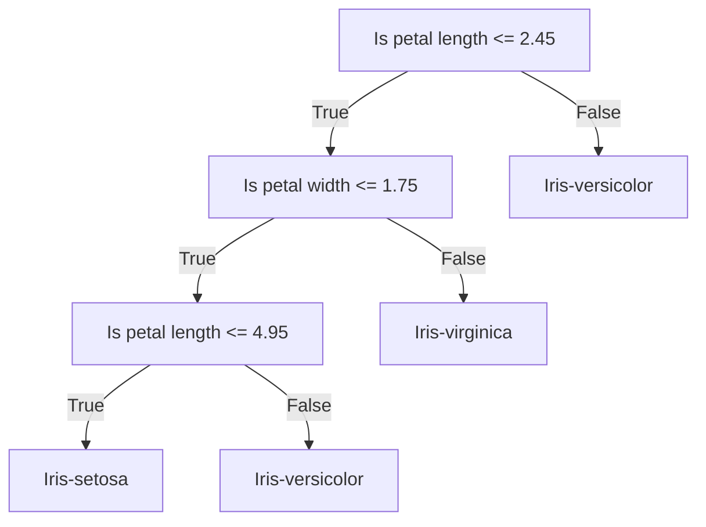

# Decision Tree

A decision tree is a flowchart-like tree structure where an internal node represents a feature(or attribute), the branch represents a decision rule, and each leaf node represents the outcome. The topmost node in a decision tree is known as the root node. It learns to partition on the basis of the attribute value.

For example,



## Idea

The idea of decision tree is to use a rule on each node to separate the data into different classes, and do this recursively until the data is pure or the tree reaches a certain depth.

Because we can allow arbitrary depth. We usually keep the rule simple, typically using $x_i \leq c$ as the rule. Where, if $x_i$ is continuous, we can choose $c$ from, for example, $\mu + k \sigma \; \text{where} \; k \in \mathbb{Z}$. If it is discreet, we can choose $c$ from all possible $x_i$ values.

Now the key is to find how to choose the best rule- of course, randomly choosing is valid, but it is not good.

## Tree Construction

A common approach is to calculate the feature with most information gain. That, is, we iterate through all candidate $c$ values, and find out the one that gives the most information gain.

That is to say, if $c \in \mathbb{C}$, and with rule $x_i \leq c$, we can separate the data into two set $x_{left}$ and $x_{right}$, then the information gain is:

$$
c = argmax_{c \in \mathbb{C}} \; H(y|x) - \frac{|x_{left}|}{|x|} H(y|x_{left}) - \frac{|x_{right}|}{|x|} H(y|x_{right})
$$

Where $H(y|x)$ is the mutual entropy of $y$ given $x$.

:::tip

Mutual entropy of a distribution $p(y|x)$ is defined as,

$$
H(y|x) = \mathbb{E}(-p(y|x) \; log \; p(y|x))
$$

Information entropy is the measure of how uncertain a distribution is.

Before the split, our total entropy is $H(y|x)$, and after the split, it is $\frac{|x_{left}|}{|x|} H(y|x_{left}) + \frac{|x_{right}|}{|x|} H(y|x_{right})$. We would like to reduce the most uncertainty with one rule, thus we maximize the information gain of the splitting process.

:::

We can do such thing recursively until the data is pure or the tree reaches a certain depth, so as to prevent from infinite growth due to noise.

## Implementation

```python
import numpy as np
from sklearn.datasets import load_iris

# Load dataset
data = load_iris()
X, y = data.data, data.target

# Split dataset using numpy
indices = np.random.permutation(len(X))
train_size = int(0.8 * len(X))
X_train, y_train = X[indices[:train_size]], y[indices[:train_size]]
X_test, y_test = X[indices[train_size:]], y[indices[train_size:]]

class DecisionTree:
    def __init__(self, max_depth=None):
        self.max_depth = max_depth
        self.tree = None
        
    def fit(self, X, y):
        self.tree = self._grow_tree(X, y)
    
    def _grow_tree(self, X, y, depth=0):
        # Calculate class distribution
        counts = np.bincount(y)
        predicted_class = np.argmax(counts)
        
        node = {
            'value': predicted_class,
            'samples': len(y),
        }
        
        # Split recursively until maximum depth is reached
        if depth < (self.max_depth if self.max_depth else float('inf')):
            feature, threshold = self._best_split(X, y)
            if feature is not None:
                left_idx = X[:, feature] <= threshold
                node['feature'] = feature
                node['threshold'] = threshold
                node['left'] = self._grow_tree(X[left_idx], y[left_idx], depth+1)
                node['right'] = self._grow_tree(X[~left_idx], y[~left_idx], depth+1)
        return node
    
    def _best_split(self, X, y):
        best_gain = -np.inf
        best_feature, best_threshold = None, None
        
        for feature in range(X.shape[1]):
            thresholds = np.unique(X[:, feature])
            for threshold in thresholds:
                left_idx = X[:, feature] <= threshold
                if len(np.unique(left_idx)) < 2:
                    continue  # Skip invalid splits
                gain = self._information_gain(y, left_idx)
                if gain > best_gain:
                    best_gain = gain
                    best_feature = feature
                    best_threshold = threshold
        return best_feature, best_threshold
    
    def _information_gain(self, y, left_idx):
        # Calculate parent entropy
        p = self._entropy(y)
        
        # Calculate weighted child entropy
        n_left, n_right = np.sum(left_idx), len(y) - np.sum(left_idx)
        e_left = self._entropy(y[left_idx]) if n_left > 0 else 0
        e_right = self._entropy(y[~left_idx]) if n_right > 0 else 0
        
        return p - (n_left/len(y) * e_left + n_right/len(y) * e_right)
    
    def _entropy(self, y):
        counts = np.bincount(y)
        probabilities = counts / len(y)
        return -np.sum([p * np.log2(p) for p in probabilities if p > 0])
    
    def predict(self, X):
        return np.array([self._traverse(x, self.tree) for x in X])
    
    def _traverse(self, x, node):
        if 'feature' not in node:  # Leaf node
            return node['value']
        if x[node['feature']] <= node['threshold']:
            return self._traverse(x, node['left'])
        else:
            return self._traverse(x, node['right'])

# Train and evaluate
model = DecisionTree(max_depth=1024)
model.fit(X_train, y_train)
y_pred = model.predict(X_test)

accuracy = np.mean(y_pred == y_test)
print(f"Test accuracy: {accuracy:.4f}")
print("Sample predictions:", y_pred[:10])
print("Actual labels:     ", y_test[:10])
```
