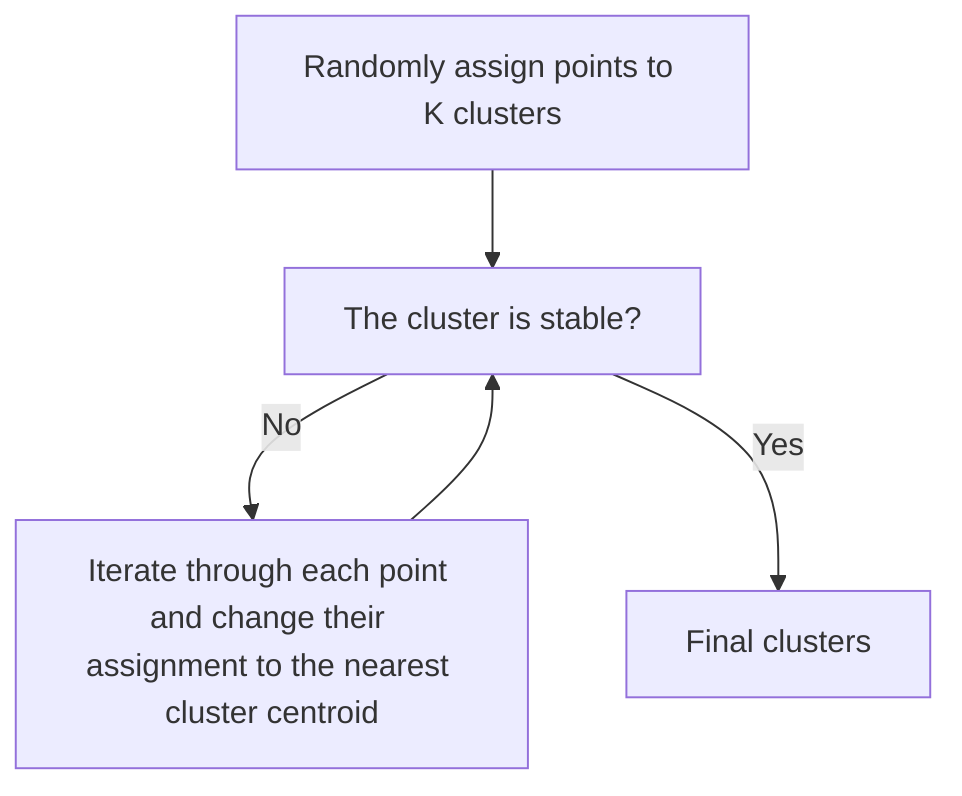
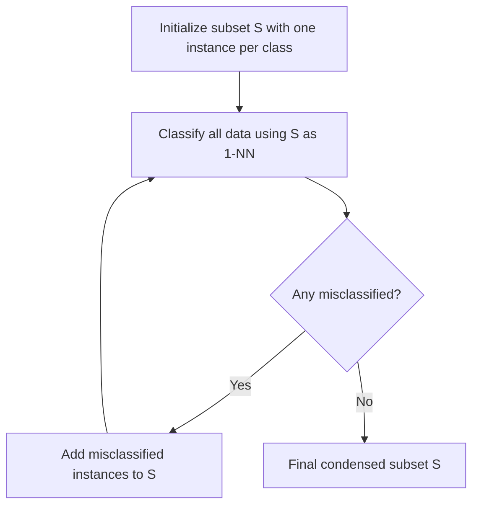
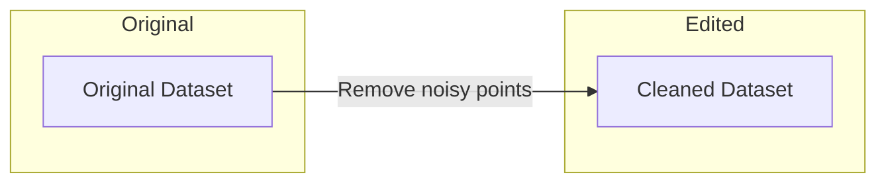

# Nearest Neighbors

Nearest Neighbors Algorithm has the simplest idea. It is based on the idea that, if two points are close to each other, they are likely to be in the same class.

## NN for Regression and Classification

That is to say, for the dataset $\mathcal{D} = \{(x_1, y_1), (x_2, y_2), \ldots, (x_n, y_n)\}$, the prediction would be,

$$
\hat{y} = \hat{y_i} \; \text{where} \; i = argmin_{i} \; dist(x, x_i)
$$

:::tip

A function is a distance function in a linear space if and only if it satisfies the following conditions:

- $dist(x, y) \geq 0$
- $dist(x, y) = 0 \; \text{if and only if} \; x = y$
- $dist(x, y) = dist(y, x)$
- $dist(x, y) + dist(y, z) \geq dist(x, z)$

For example, besides the Euclidean distance, you can also use, Gaussian distance,

$$
dist(x, y) = 1 - exp(-\frac{||x - y||^2}{2\sigma^2})
$$

A linear space with a distance function is called a metric space.

For inner product space, a natural distance function is,

$$
dist(x, y) = \langle x, y \rangle
$$

:::

Yes, the idea is very simple. Another improvement to the algorithm is instead, use k-nearest neighbors, then calculate their weight for the final result. This is more robust to noise. For regression, it is also possible to use the weighted average of the k-nearest neighbors.

Mathematically, if $y$ is continuous, the prediction would be,

$$
\hat{y} = \sum_{i=1}^{k} \frac{w_i}{\sum_{j = 1}^k w_j} y_i
$$

Where $w_i$ is the weight of the $i$-th nearest neighbor.

If $y$ is discrete, the prediction would be,

$$
\hat{y} = argmax_{y} \sum_{i=1}^{k} \mathbb{I}(y_i = y) w_i
$$

:::tip

$\mathbb{I}$ is an indicator function. It is defined as,

$$
\mathbb{I}(x) = \begin{cases} 1 & \text{if} \; x \; \text{is true} \\ 0 & \text{otherwise} \end{cases}
$$

:::

We usually just use the inverted distance function as the weight. That is to say, $w_i = \frac{1}{dist(x, x_i)}$.

## NN for Clustering

NN for clustering is sometimes called K-means. Clustering problem is to, give a set of,

$$
\mathcal{D} = \{x_1, x_2, \ldots, x_n\}
$$

Label each data point with a cluster label, with each cluster similar within itself and different from other clusters. As to how to define similarity, it is up to specific algorithms. For K-means, similar means close to the center of a cluster, known as the centroid.



## K-Means Implementation

```python
import numpy as np
import plotly.express as px
from sklearn.datasets import make_blobs

class KMeans:
    def __init__(self, k=3, max_iter=100):
        self.k = k
        self.max_iter = max_iter
        self.centroids = None
        
    def _euclidean_distance(self, a, b):
        """Mathematical foundation: L2 norm in Euclidean space"""
        return np.sqrt(np.sum((a - b)**2, axis=1))
    
    def fit(self, X):
        # Random initialization using Forgy method
        self.centroids = X[np.random.choice(X.shape[0], self.k, replace=False)]
        
        for _ in range(self.max_iter):
            # Assignment step: nearest centroid using Voronoi partitioning
            distances = np.array([self._euclidean_distance(X, c) for c in self.centroids])
            labels = np.argmin(distances, axis=0)
            
            # Update step: minimize within-cluster variance
            new_centroids = np.array([X[labels == i].mean(axis=0) for i in range(self.k)])
            
            if np.allclose(self.centroids, new_centroids):
                break
            self.centroids = new_centroids
            
        return self
    
    def predict(self, X):
        distances = np.array([self._euclidean_distance(X, c) for c in self.centroids])
        return np.argmin(distances, axis=0)

# Generate sample data using Gaussian mixtures (mathematical foundation)
X, y = make_blobs(n_samples=300, centers=3, cluster_std=0.6, random_state=0)

# Train K-Means with mathematical properties:
# 1. Converges to local minimum of WCSS: min ΣΣ ||x - μ_i||²
# 2. Assumes spherical clusters (due to L2 norm)
model = KMeans(k=3)
labels = model.fit(X).predict(X)

# Visualize with cluster centers and decision boundaries
fig = px.scatter(x=X[:, 0], y=X[:, 1], color=labels.astype(str),
                 title=f"K-Means Clustering (k=3)<br>SSE: {model._calculate_sse(X, labels):.2f}",
                 labels={'x': 'Feature 1', 'y': 'Feature 2'})
fig.add_scatter(x=model.centroids[:, 0], y=model.centroids[:, 1],
                mode='markers', marker=dict(color='black', size=12, symbol='x'),
                name='Centroids')
fig.show()
```

## NN Storage Crisis

Everything seems good- but this chapter isn't ending. The problem here is, for NN algorithm, to make a prediction, we must store all the data points. Which is not good for large datasets. So, we need to find a way to reduce the storage. This chapter is more focused on this problem.

## Condensed Nearest Neighbor (CNN)



CNN preserves the decision boundary geometry. For a classifier $f(x)$ , the decision boundary is defined as $\{x | \exists y \neq y': f(x) = y \}$ . By retaining only instances that define this boundary, we maintain the Voronoi diagram structure while discarding interior points that don't affect classifications. The iterative process minimizes $ |S| $ while satisfying:

$$
\forall x_i \in \mathcal{D},\; \text{NN}_S(x_i) = \text{NN}_{\mathcal{D}}(x_i)
$$

where $\text{NN}_S(x_i)$ denotes the nearest neighbor in subset $S$ .

## Edited Nearest Neighbor


 
ENN implements a form of low-pass filtering. For a point $x_i$, if $\hat{y}_i \neq y_i$ where $\hat{y}_i = \text{majority}(k\text{-NN}(x_i))$, then $x_i$ is considered noise. This follows from the smoothness assumption in machine learning: similar instances should have similar labels.
